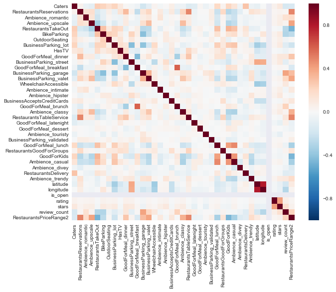

## Contents
{:.no_toc}
*  
{: toc}


After pulling data from the Yelp data set challenge, converting it to CSV files (other than the user file), and filtering out unneeded variables and removed all businesses that are not 'Restaurants' (by category).

We will check the prevalence of tips, check-ins, and photos, but we suspect that only the reviews, users, and businesses data will be useful.

## Read in Data


```python
checkins = pd.read_csv('Data/checkin_summary.csv', header=None)
photos = pd.read_csv('Data/photos_summary.csv', header=None)
reviews = pd.read_csv('Data/review_small.csv', header=None)
biz = pd.read_csv('Data/small_businesses.csv')
tips = pd.read_csv('Data/tip_summary.csv', header=None)
users = pd.read_json(path_or_buf='Data/user_small.json', lines=True)
```


    /anaconda/lib/python3.6/site-packages/IPython/core/interactiveshell.py:2717: DtypeWarning: Columns (1,10,12,14,20,63,64,74) have mixed types. Specify dtype option on import or set low_memory=False.
      interactivity=interactivity, compiler=compiler, result=result)


## Clean Columns and Data


```python
checkins.shape, photos.shape, reviews.shape, biz.shape, tips.shape, users.shape
```


    ((49414, 2), (26384, 2), (2927859, 4), (38668, 93), (558979, 3), (1183362, 7))


```python
## Users: count years with elite status and convert join_date to DateTime
users['elite_count'] = users.iloc[:,1].apply(lambda x: len(x))
users['join_date'] = pd.to_datetime(users['yelping_since'])
users.head()
```


<div>
<style>
    .dataframe thead tr:only-child th {
        text-align: right;
    }

    .dataframe thead th {
        text-align: left;
    }

    .dataframe tbody tr th {
        vertical-align: top;
    }
</style>
<table border="1" class="dataframe">
  <thead>
    <tr style="text-align: right;">
      <th></th>
      <th>average_stars</th>
      <th>elite</th>
      <th>review_count</th>
      <th>user_id</th>
      <th>yelping_since</th>
      <th>elite_count</th>
      <th>join_date</th>
    </tr>
  </thead>
  <tbody>
    <tr>
      <th>0</th>
      <td>3.80</td>
      <td>[2014, 2016, 2013, 2011, 2012, 2015, 2010, 2017]</td>
      <td>272</td>
      <td>lsSiIjAKVl-QRxKjRErBeg</td>
      <td>2010-07-13</td>
      <td>8</td>
      <td>2010-07-13</td>
    </tr>
    <tr>
      <th>1</th>
      <td>3.94</td>
      <td>[2014, 2017, 2011, 2012, 2015, 2009, 2013, 200...</td>
      <td>2559</td>
      <td>om5ZiponkpRqUNa3pVPiRg</td>
      <td>2006-01-18</td>
      <td>12</td>
      <td>2006-01-18</td>
    </tr>
    <tr>
      <th>2</th>
      <td>4.72</td>
      <td>[]</td>
      <td>277</td>
      <td>-lGwMGHMC_XihFJNKCJNRg</td>
      <td>2014-10-31</td>
      <td>0</td>
      <td>2014-10-31</td>
    </tr>
    <tr>
      <th>3</th>
      <td>3.76</td>
      <td>[2016, 2017]</td>
      <td>436</td>
      <td>D-ydMTPGWXTVm4_jjp0k9g</td>
      <td>2013-04-01</td>
      <td>2</td>
      <td>2013-04-01</td>
    </tr>
    <tr>
      <th>4</th>
      <td>4.23</td>
      <td>[2017, 2016]</td>
      <td>921</td>
      <td>PcvbBOCOcs6_suRDH7TSTg</td>
      <td>2012-08-16</td>
      <td>2</td>
      <td>2012-08-16</td>
    </tr>
  </tbody>
</table>
</div>


```python
users.dtypes
```


    average_stars           float64
    elite                    object
    review_count              int64
    user_id                  object
    yelping_since            object
    elite_count               int64
    join_date        datetime64[ns]
    dtype: object


```python
## Checkins: Add column headers
checkins.columns = ['business_id', 'num_checkins']
checkins.head()
```


<div>
<style>
    .dataframe thead tr:only-child th {
        text-align: right;
    }

    .dataframe thead th {
        text-align: left;
    }

    .dataframe tbody tr th {
        vertical-align: top;
    }
</style>
<table border="1" class="dataframe">
  <thead>
    <tr style="text-align: right;">
      <th></th>
      <th>business_id</th>
      <th>num_checkins</th>
    </tr>
  </thead>
  <tbody>
    <tr>
      <th>0</th>
      <td>--6MefnULPED_I942VcFNA</td>
      <td>122</td>
    </tr>
    <tr>
      <th>1</th>
      <td>--9e1ONYQuAa-CB_Rrw7Tw</td>
      <td>2469</td>
    </tr>
    <tr>
      <th>2</th>
      <td>--DaPTJW3-tB1vP-PfdTEg</td>
      <td>88</td>
    </tr>
    <tr>
      <th>3</th>
      <td>--FBCX-N37CMYDfs790Bnw</td>
      <td>477</td>
    </tr>
    <tr>
      <th>4</th>
      <td>--GM_ORV2cYS-h38DSaCLw</td>
      <td>13</td>
    </tr>
  </tbody>
</table>
</div>


```python
## Photos: Add column headers
photos.columns = ['business_id', 'num_photos']
photos.head()
```


<div>
<style>
    .dataframe thead tr:only-child th {
        text-align: right;
    }

    .dataframe thead th {
        text-align: left;
    }

    .dataframe tbody tr th {
        vertical-align: top;
    }
</style>
<table border="1" class="dataframe">
  <thead>
    <tr style="text-align: right;">
      <th></th>
      <th>business_id</th>
      <th>num_photos</th>
    </tr>
  </thead>
  <tbody>
    <tr>
      <th>0</th>
      <td>--6MefnULPED_I942VcFNA</td>
      <td>1</td>
    </tr>
    <tr>
      <th>1</th>
      <td>--9e1ONYQuAa-CB_Rrw7Tw</td>
      <td>127</td>
    </tr>
    <tr>
      <th>2</th>
      <td>--DaPTJW3-tB1vP-PfdTEg</td>
      <td>1</td>
    </tr>
    <tr>
      <th>3</th>
      <td>--FBCX-N37CMYDfs790Bnw</td>
      <td>4</td>
    </tr>
    <tr>
      <th>4</th>
      <td>--KCl2FvVQpvjzmZSPyviA</td>
      <td>3</td>
    </tr>
  </tbody>
</table>
</div>


```python
## Reviews: Add column headers and convert review_date to DateTime
reviews.columns = ['user_id', 'business_id', 'rating', 'date']
reviews['review_date'] = pd.to_datetime(reviews['date'])
reviews.head()
```


<div>
<style>
    .dataframe thead tr:only-child th {
        text-align: right;
    }

    .dataframe thead th {
        text-align: left;
    }

    .dataframe tbody tr th {
        vertical-align: top;
    }
</style>
<table border="1" class="dataframe">
  <thead>
    <tr style="text-align: right;">
      <th></th>
      <th>user_id</th>
      <th>business_id</th>
      <th>rating</th>
      <th>date</th>
      <th>review_date</th>
    </tr>
  </thead>
  <tbody>
    <tr>
      <th>0</th>
      <td>V2exkc2JwEdc8UNUNhT7sg</td>
      <td>--6MefnULPED_I942VcFNA</td>
      <td>5</td>
      <td>2016-08-25</td>
      <td>2016-08-25</td>
    </tr>
    <tr>
      <th>1</th>
      <td>j97y1ZAsYABIOcR0KQCy5Q</td>
      <td>--6MefnULPED_I942VcFNA</td>
      <td>1</td>
      <td>2010-12-06</td>
      <td>2010-12-06</td>
    </tr>
    <tr>
      <th>2</th>
      <td>8-KBKMJVO-j5YqpHb08j9w</td>
      <td>--6MefnULPED_I942VcFNA</td>
      <td>4</td>
      <td>2015-08-05</td>
      <td>2015-08-05</td>
    </tr>
    <tr>
      <th>3</th>
      <td>CxDOIDnH8gp9KXzpBHJYXw</td>
      <td>--6MefnULPED_I942VcFNA</td>
      <td>2</td>
      <td>2010-12-22</td>
      <td>2010-12-22</td>
    </tr>
    <tr>
      <th>4</th>
      <td>7Dykd1HolQx8mKPYhYDYSg</td>
      <td>--6MefnULPED_I942VcFNA</td>
      <td>2</td>
      <td>2017-02-07</td>
      <td>2017-02-07</td>
    </tr>
  </tbody>
</table>
</div>


```python
## Business: Clean column names
biz.columns=biz.columns.str.replace('attributes.','')
biz.columns=biz.columns.str.replace('.',"_")
biz.head()
```


<div>
<style>
    .dataframe thead tr:only-child th {
        text-align: right;
    }

    .dataframe thead th {
        text-align: left;
    }

    .dataframe tbody tr th {
        vertical-align: top;
    }
</style>
<table border="1" class="dataframe">
  <thead>
    <tr style="text-align: right;">
      <th></th>
      <th>Ambience_divey</th>
      <th>HairSpecializesIn_kids</th>
      <th>RestaurantsDelivery</th>
      <th>Open24Hours</th>
      <th>Ambience_trendy</th>
      <th>DogsAllowed</th>
      <th>CoatCheck</th>
      <th>postal_code</th>
      <th>Smoking</th>
      <th>DietaryRestrictions_halal</th>
      <th>...</th>
      <th>RestaurantsReservations</th>
      <th>DietaryRestrictions_dairy-free</th>
      <th>BestNights_wednesday</th>
      <th>DietaryRestrictions_vegan</th>
      <th>Ambience_romantic</th>
      <th>Music_jukebox</th>
      <th>Ambience_upscale</th>
      <th>RestaurantsTakeOut</th>
      <th>BikeParking</th>
      <th>OutdoorSeating</th>
    </tr>
  </thead>
  <tbody>
    <tr>
      <th>0</th>
      <td>False</td>
      <td>NaN</td>
      <td>False</td>
      <td>NaN</td>
      <td>False</td>
      <td>NaN</td>
      <td>False</td>
      <td>28105</td>
      <td>NaN</td>
      <td>NaN</td>
      <td>...</td>
      <td>False</td>
      <td>NaN</td>
      <td>NaN</td>
      <td>NaN</td>
      <td>False</td>
      <td>False</td>
      <td>False</td>
      <td>True</td>
      <td>True</td>
      <td>False</td>
    </tr>
    <tr>
      <th>1</th>
      <td>NaN</td>
      <td>NaN</td>
      <td>NaN</td>
      <td>NaN</td>
      <td>NaN</td>
      <td>NaN</td>
      <td>NaN</td>
      <td>28164</td>
      <td>NaN</td>
      <td>NaN</td>
      <td>...</td>
      <td>NaN</td>
      <td>NaN</td>
      <td>NaN</td>
      <td>NaN</td>
      <td>NaN</td>
      <td>NaN</td>
      <td>NaN</td>
      <td>NaN</td>
      <td>NaN</td>
      <td>False</td>
    </tr>
    <tr>
      <th>2</th>
      <td>True</td>
      <td>NaN</td>
      <td>False</td>
      <td>NaN</td>
      <td>False</td>
      <td>NaN</td>
      <td>NaN</td>
      <td>15224</td>
      <td>NaN</td>
      <td>NaN</td>
      <td>...</td>
      <td>False</td>
      <td>NaN</td>
      <td>NaN</td>
      <td>NaN</td>
      <td>False</td>
      <td>NaN</td>
      <td>False</td>
      <td>True</td>
      <td>True</td>
      <td>False</td>
    </tr>
    <tr>
      <th>3</th>
      <td>NaN</td>
      <td>NaN</td>
      <td>False</td>
      <td>NaN</td>
      <td>NaN</td>
      <td>NaN</td>
      <td>NaN</td>
      <td>L5W 0E6</td>
      <td>NaN</td>
      <td>NaN</td>
      <td>...</td>
      <td>True</td>
      <td>NaN</td>
      <td>NaN</td>
      <td>NaN</td>
      <td>NaN</td>
      <td>NaN</td>
      <td>NaN</td>
      <td>True</td>
      <td>NaN</td>
      <td>True</td>
    </tr>
    <tr>
      <th>4</th>
      <td>False</td>
      <td>NaN</td>
      <td>False</td>
      <td>NaN</td>
      <td>False</td>
      <td>NaN</td>
      <td>NaN</td>
      <td>53704</td>
      <td>NaN</td>
      <td>NaN</td>
      <td>...</td>
      <td>True</td>
      <td>NaN</td>
      <td>NaN</td>
      <td>NaN</td>
      <td>False</td>
      <td>NaN</td>
      <td>False</td>
      <td>True</td>
      <td>True</td>
      <td>False</td>
    </tr>
  </tbody>
</table>
<p>5 rows × 93 columns</p>
</div>


```python
## Tips: Add column headers and fix business_id, user_id
tips.columns = ['business_id', 'user_id', 'unidentifiedinfo_tips']

tips['business_id'] = tips['business_id'].map(lambda x: x[1:])
tips['user_id'] = tips['user_id'].map(lambda x: x[:-1])
tips.head()
```


<div>
<style>
    .dataframe thead tr:only-child th {
        text-align: right;
    }

    .dataframe thead th {
        text-align: left;
    }

    .dataframe tbody tr th {
        vertical-align: top;
    }
</style>
<table border="1" class="dataframe">
  <thead>
    <tr style="text-align: right;">
      <th></th>
      <th>business_id</th>
      <th>user_id</th>
      <th>unidentifiedinfo_tips</th>
    </tr>
  </thead>
  <tbody>
    <tr>
      <th>0</th>
      <td>---1lKK3aKOuomHnwAkAow</td>
      <td>0zoXYHq82haayMaV952jEQ</td>
      <td>1</td>
    </tr>
    <tr>
      <th>1</th>
      <td>---1lKK3aKOuomHnwAkAow</td>
      <td>A0X1baHPgw9IiBRivu0G9g</td>
      <td>2</td>
    </tr>
    <tr>
      <th>2</th>
      <td>---1lKK3aKOuomHnwAkAow</td>
      <td>Qy_tDaVTWlS14fEglzo1Tg</td>
      <td>1</td>
    </tr>
    <tr>
      <th>3</th>
      <td>---1lKK3aKOuomHnwAkAow</td>
      <td>RRw9I8pHt5PzgYGT2QeODw</td>
      <td>1</td>
    </tr>
    <tr>
      <th>4</th>
      <td>---1lKK3aKOuomHnwAkAow</td>
      <td>Xspg78dOvuedvuPEUwZBjw</td>
      <td>1</td>
    </tr>
  </tbody>
</table>
</div>


## Check the relevance of tips, photos, and users


```python
print(len(tips.user_id.unique()))
print(len(tips.user_id.unique())/len(users))
```


    43082
    0.03640644198478572


Since these represent less than 4 percent of all users, we can disregard them for analysis.


```python
#Merge business and photos for only the businesses in each set
photo_biz = pd.merge(photos, biz, on='business_id', how='inner')
print(len(photo_biz.business_id.unique()))
print(len(photo_biz.business_id.unique())/len(biz))
```


    21480
    0.5554980862728871


Here we see a much greater share of businesses with photos, but we still have barely over half of businesses with photos (so it may not be a good predictor of popularity across the data set.


```python
#Merge business and checkins for only the businesses in each set
checkin_biz = pd.merge(checkins, biz, on='business_id', how='inner')
print(len(checkin_biz.business_id.unique()))
print(len(checkin_biz.business_id.unique())/len(biz))
```


    37533
    0.9706475638771077


```python
fig, ax = plt.subplots(1, 1, figsize=(9, 8))

#plt.hist(checkin_biz.num_checkins[checkin_biz.num_checkins < 1000], bins = 100, color=sns.color_palette()[5], alpha=0.75)
#plt.title('Distribution of Number of Check-ins per Restaurant')

plt.scatter(checkin_biz.stars, checkin_biz.num_checkins, color=sns.color_palette()[5], alpha=0.75)

```


    <matplotlib.collections.PathCollection at 0x13cc12908>


We see that check-ins matches up somewhat well to the average business rating, but we will see if other factors better describe ratings.

## Now the good stuff: Exploring User and Review Data


```python
users_viz = users[['user_id', 'average_stars', 'review_count', 'elite_count', 'join_date']]
reviews_viz = reviews[['user_id', 'business_id', 'rating', 'review_date']]
```


```python
user_review_viz = pd.merge(users_viz, reviews_viz, on='user_id', how='outer')
```


```python
fig, ax = plt.subplots(1,1, figsize =(10,8))
sns.heatmap(user_review_viz.corr(), ax=ax)
```


    <matplotlib.axes._subplots.AxesSubplot at 0x13cc2ea58>


We see that average_stars and the given rating for a review correlate; meaning that there is some stickiness to a restaurant's overall review. We also see that review_count and elite_count correlate with one another, which makes sense, as Yelp likely selects elite users among those that review most often. However, neither are very important towards rating, so we'll leave those be for now.


```python
fig, ax = plt.subplots(1, 2, figsize=(18, 8))

plt.subplot(1, 2, 1)
plt.hist(reviews_viz.rating, color=sns.color_palette()[5], alpha=0.75, align='mid')
plt.xticks([1,2,3,4,5])
plt.title('Distribution of Given Ratings')

plt.subplot(1, 2, 2)
plt.hist(users_viz.average_stars, color=sns.color_palette()[5], alpha=0.75)
plt.title('Distribution of Average Star Ratings')
```


    <matplotlib.text.Text at 0x13dbae828>


Here, we begin to see the distribution of ratings. Corroborating the result above, the distribution of ratings and average_stars match one another quite closely.They're skewed towards higher ratings (4s and 5s). But how much so?


```python
users.describe()
```


<div>
<style>
    .dataframe thead tr:only-child th {
        text-align: right;
    }

    .dataframe thead th {
        text-align: left;
    }

    .dataframe tbody tr th {
        vertical-align: top;
    }
</style>
<table border="1" class="dataframe">
  <thead>
    <tr style="text-align: right;">
      <th></th>
      <th>average_stars</th>
      <th>review_count</th>
      <th>elite_count</th>
    </tr>
  </thead>
  <tbody>
    <tr>
      <th>count</th>
      <td>1.183362e+06</td>
      <td>1.183362e+06</td>
      <td>1.183362e+06</td>
    </tr>
    <tr>
      <th>mean</th>
      <td>3.711835e+00</td>
      <td>2.372686e+01</td>
      <td>1.525848e-01</td>
    </tr>
    <tr>
      <th>std</th>
      <td>1.105231e+00</td>
      <td>8.050645e+01</td>
      <td>8.163861e-01</td>
    </tr>
    <tr>
      <th>min</th>
      <td>1.000000e+00</td>
      <td>0.000000e+00</td>
      <td>0.000000e+00</td>
    </tr>
    <tr>
      <th>25%</th>
      <td>3.130000e+00</td>
      <td>2.000000e+00</td>
      <td>0.000000e+00</td>
    </tr>
    <tr>
      <th>50%</th>
      <td>3.890000e+00</td>
      <td>5.000000e+00</td>
      <td>0.000000e+00</td>
    </tr>
    <tr>
      <th>75%</th>
      <td>4.570000e+00</td>
      <td>1.600000e+01</td>
      <td>0.000000e+00</td>
    </tr>
    <tr>
      <th>max</th>
      <td>5.000000e+00</td>
      <td>1.165600e+04</td>
      <td>1.300000e+01</td>
    </tr>
  </tbody>
</table>
</div>


```python
reviews.describe()
```


<div>
<style>
    .dataframe thead tr:only-child th {
        text-align: right;
    }

    .dataframe thead th {
        text-align: left;
    }

    .dataframe tbody tr th {
        vertical-align: top;
    }
</style>
<table border="1" class="dataframe">
  <thead>
    <tr style="text-align: right;">
      <th></th>
      <th>rating</th>
    </tr>
  </thead>
  <tbody>
    <tr>
      <th>count</th>
      <td>2.927859e+06</td>
    </tr>
    <tr>
      <th>mean</th>
      <td>3.702164e+00</td>
    </tr>
    <tr>
      <th>std</th>
      <td>1.343472e+00</td>
    </tr>
    <tr>
      <th>min</th>
      <td>1.000000e+00</td>
    </tr>
    <tr>
      <th>25%</th>
      <td>3.000000e+00</td>
    </tr>
    <tr>
      <th>50%</th>
      <td>4.000000e+00</td>
    </tr>
    <tr>
      <th>75%</th>
      <td>5.000000e+00</td>
    </tr>
    <tr>
      <th>max</th>
      <td>5.000000e+00</td>
    </tr>
  </tbody>
</table>
</div>


It's notable that the mean of rating and the median is 4, indicating that the distribution of reviews is skewed towards higher star ratings.


```python
fig, ax = plt.subplots(1, 1, figsize=(9, 8))

#plt.subplot(1, 2, 1)
plt.hist(users_viz.review_count[users_viz.review_count < 100], bins = 100, color=sns.color_palette()[5], alpha=0.75)
plt.title('Distribution of Number of Reviews per User')
```


    <matplotlib.text.Text at 0x13e0c19b0>


We can also see that review_count follows an exponential decay function with a long tail—many users post just one or a handful of reviews with a small segment of very active users.


```python
fig, ax = plt.subplots(1, 1, figsize=(9, 8))
plt.scatter(users.average_stars, users.review_count, color=sns.color_palette()[5], alpha=0.75)
plt.xlabel("User's Average Rating")
plt.ylabel('Number of Reviews')
plt.title('Average Rating by User Activity')
```


    <matplotlib.text.Text at 0x13f16b0f0>


```python

#Calculate shares of ratings by elite status
elite_lvl = np.array(user_review_viz['elite_count'].unique())
elite_lvl.sort()

rating_props_1star = [user_review_viz.rating[(user_review_viz.rating == 1) & (user_review_viz.elite_count == i)].count()/user_review_viz.rating[user_review_viz.elite_count == i].count() for i in range(0,14)]
rating_props_2star = [user_review_viz.rating[(user_review_viz.rating == 2) & (user_review_viz.elite_count == i)].count()/user_review_viz.rating[user_review_viz.elite_count == i].count() for i in range(0,14)]
rating_props_3star = [user_review_viz.rating[(user_review_viz.rating == 3) & (user_review_viz.elite_count == i)].count()/user_review_viz.rating[user_review_viz.elite_count == i].count() for i in range(0,14)]
rating_props_4star = [user_review_viz.rating[(user_review_viz.rating == 4) & (user_review_viz.elite_count == i)].count()/user_review_viz.rating[user_review_viz.elite_count == i].count() for i in range(0,14)]
rating_props_5star = [user_review_viz.rating[(user_review_viz.rating == 5) & (user_review_viz.elite_count == i)].count()/user_review_viz.rating[user_review_viz.elite_count == i].count() for i in range(0,14)]
```


```python
f, ax = plt.subplots(1, figsize=(10,5))

ax.bar(elite_lvl, rating_props_1star, label = '1-star review', alpha=0.6, color = '#a6611a')
ax.bar(elite_lvl, rating_props_2star, bottom = rating_props_1star, label = '2-star review', alpha=0.6, color = '#dfc27d')
ax.bar(elite_lvl, rating_props_3star, bottom = [i+j for i,j in zip(rating_props_1star, rating_props_2star)], label = '3-star review', alpha=0.8, color = '#f5f5f5')
ax.bar(elite_lvl, rating_props_4star, bottom = [i+j+k for i,j,k in zip(rating_props_1star, rating_props_2star, rating_props_3star)], label = '4-star review', alpha=0.6, color = '#80cdc1')
ax.bar(elite_lvl, rating_props_5star, bottom = [i+j+k+l for i,j,k,l in zip(rating_props_1star, rating_props_2star, rating_props_3star, rating_props_4star)], label = '5-star review', alpha=0.6, color = '#018571')

plt.xlabel("Number of Years with Elite Status")
plt.title('Distribution of Reviews by Elite Users')
plt.legend(bbox_to_anchor = (1.02,0.5) , loc = 'center left')
plt.xticks(range(0,14))
```


    ([<matplotlib.axis.XTick at 0x13ddcce10>,
      <matplotlib.axis.XTick at 0x13f3a0fd0>,
      <matplotlib.axis.XTick at 0x13f23f208>,
      <matplotlib.axis.XTick at 0x13fda5358>,
      <matplotlib.axis.XTick at 0x13fda5e10>,
      <matplotlib.axis.XTick at 0x13fdaf908>,
      <matplotlib.axis.XTick at 0x13fdb9400>,
      <matplotlib.axis.XTick at 0x13fdb9eb8>,
      <matplotlib.axis.XTick at 0x13fdc59b0>,
      <matplotlib.axis.XTick at 0x13fdcb4a8>,
      <matplotlib.axis.XTick at 0x13fdcbf60>,
      <matplotlib.axis.XTick at 0x13fdd5a20>,
      <matplotlib.axis.XTick at 0x13fde4550>,
      <matplotlib.axis.XTick at 0x13fdf2048>],
     <a list of 14 Text xticklabel objects>)


```python
users.elite[users.elite_count > 0].count()/len(users)
```


    0.047425048294604692


We find that those without Elite status are more likely to give 1- or 5-star reviews (which follows one-and-done angry/happy reviewers). However a very small share of users (4.7%) ever reach elite status.

## Exploring Restaurant and Review Data


```python
#Merge reviews and business for only the businesses in each set
full_biz = pd.merge(reviews, biz, on='business_id', how='inner')
```


```python
full_biz.shape, reviews.shape, biz.shape

#Caused a drop of 2927859 - 2531183
```


    ((2531183, 97), (2927859, 5), (38668, 93))


```python
#Drop where more than 50 percent (1,265,591) missing
full_biz = full_biz.dropna(thresh=len(full_biz) - 1265591, axis=1)
full_biz.shape
```


    (2531183, 53)


By dropping features with more than 50 percent of missing records, we've gotten rid of 44 inconsistently available features. We have to do this because we're not sure if those features are missing because they should be `False`, but we can't be sure if that information is missing inconsistently.


```python
#Create list of variable types so we can continue cleaning.

binary_vars = ["Caters","RestaurantsReservations","Ambience_romantic","Ambience_upscale",
               "RestaurantsTakeOut","BikeParking","OutdoorSeating","BusinessParking_lot","HasTV","GoodForMeal_dinner",
               "BusinessParking_street","GoodForMeal_breakfast","BusinessParking_garage","BusinessParking_valet",
               "WheelchairAccessible","Ambience_intimate","Ambience_hipster","BusinessAcceptsCreditCards",
               "GoodForMeal_brunch","Ambience_classy","RestaurantsTableService","GoodForMeal_latenight",
               "GoodForMeal_dessert","Ambience_touristy","BusinessParking_validated","GoodForMeal_lunch",
               "RestaurantsGoodForGroups","GoodForKids","Ambience_casual","Ambience_divey","RestaurantsDelivery",
               "Ambience_trendy"]

text_vars = ["user_id","business_id","postal_code","city","categories",
             "name","neighborhood","state"]

float_vars = ["latitude","longitude","is_open","rating","stars","review_count","RestaurantsPriceRange2"]

cat_vars = ["Alcohol","WiFi","NoiseLevel","RestaurantsAttire"]

date_vars = ['date']
```


```python
#Create datasets that contain just the datatypes we want, as the correct datatypes.

for var in binary_vars:
    full_biz[var] = 1*full_biz[var]

binary_df = full_biz[binary_vars].replace(np.nan, np.nan, regex=True)

for var in text_vars:
    full_biz[var] = full_biz[var].replace(np.nan, '', regex=True)
    full_biz[var] = full_biz[var].astype(str)

text_df = full_biz[text_vars]

for var in cat_vars:
    full_biz[var] = full_biz[var].replace(np.nan, '', regex=True)
    full_biz[var] = full_biz[var].astype(str)

cat_df = full_biz[cat_vars]

for var in date_vars:
    full_biz[var] = full_biz[var].replace(np.nan, '', regex=True)
    full_biz[var] = full_biz[var].astype(str)

date_df = full_biz[date_vars]

for var in float_vars:
    full_biz[var] = 1*full_biz[var]

float_df = full_biz[float_vars].replace(np.nan, np.nan, regex=True)
```


```python
full_biz2 = binary_df.join(text_df)
full_biz2 = full_biz2.join(float_df)
full_biz2 = full_biz2.join(cat_df)
full_biz2 = full_biz2.join(date_df)
```


```python
count_states = full_biz2.groupby('state').is_open.sum().sort_values()

with sns.plotting_context("poster"):
    ax = plt.gca()
    count_states.plot(kind="barh")
    plt.grid(axis = 'x', color ='white', linestyle='-')
    ax.tick_params(axis='both', which='both',length=0)
    states = count_states.index
    counts = count_states.values
    nums = np.arange(len(count_states))
    for p, c, ch in zip(nums, states, counts):
        plt.annotate(str(ch), xy=(ch + 1, p), va='center', size=11)
    sns.despine(left=True, bottom=True)
```


Here we see a number of unexpected states (based on what we were told we would receive). In addition, many of these only have a handful of reviews. Let's zoom in a little to the 9 states with the most number of reviews.


```python
#Select NV, AZ, ON, NC, OH, PA, QC, WI, BW

states = ['NV','AZ','ON','NC','OH','PA','QC','WI','BW']
geo_subset_biz = full_biz2[full_biz2['state'].isin(['NV','AZ','ON','NC','OH','PA','QC','WI','BW'])]

```


```python
count_states2 = geo_subset_biz.groupby('state').is_open.sum().sort_values()

with sns.plotting_context("poster"):
    ax = plt.gca()
    count_states2.plot(kind="barh")
    plt.grid(axis = 'x', color ='white', linestyle='-')
    ax.tick_params(axis='both', which='both',length=0)
    states = count_states2.index
    counts = count_states2.values
    nums = np.arange(len(count_states))
    for p, c, ch in zip(nums, states, counts):
        plt.annotate(str(ch), xy=(ch + 1, p), va='center', size=11)
    sns.despine(left=True, bottom=True)
```


There is particularly a big drop off between Wisconsin and Baden-Württemberg, so we will continue analysis only with the top 8 states: NV, AZ, ON, NC, OH, PA, QC, and WI (they also all happen to be in North America).


```python
geo_subset_biz.categories=geo_subset_biz.categories.str.replace('[',"")
geo_subset_biz.categories=geo_subset_biz.categories.str.replace(']',"")
geo_subset_biz.categories=geo_subset_biz.categories.str.replace("'","")
#biz.columns=biz.columns.str.replace('[',"")
geo_subset_biz.categories.unique()
len(geo_subset_biz.categories.unique())
```


    /anaconda/lib/python3.6/site-packages/pandas/core/generic.py:2999: SettingWithCopyWarning:
    A value is trying to be set on a copy of a slice from a DataFrame.
    Try using .loc[row_indexer,col_indexer] = value instead

    See the caveats in the documentation: http://pandas.pydata.org/pandas-docs/stable/indexing.html#indexing-view-versus-copy
      self[name] = value


    18557


With 18,557 different categories, we have way too many to begin to parse. It also becomes difficult because most businesses have multiple categories, so we may have to implement some kind of decision rule on which to choose.


```python
uniques = list(geo_subset_biz.categories.unique())
newlist = []
for word in uniques:
    word = word.split(",")
    #word = word.replace(' ','')
    newlist.extend(word)  # <----

newlist = [x.strip(' ') for x in newlist]

newlist

df = pd.value_counts(newlist).to_frame().reset_index()
df
```


<div>
<style>
    .dataframe thead tr:only-child th {
        text-align: right;
    }

    .dataframe thead th {
        text-align: left;
    }

    .dataframe tbody tr th {
        vertical-align: top;
    }
</style>
<table border="1" class="dataframe">
  <thead>
    <tr style="text-align: right;">
      <th></th>
      <th>index</th>
      <th>0</th>
    </tr>
  </thead>
  <tbody>
    <tr>
      <th>0</th>
      <td>Restaurants</td>
      <td>18546</td>
    </tr>
    <tr>
      <th>1</th>
      <td>Food</td>
      <td>6546</td>
    </tr>
    <tr>
      <th>2</th>
      <td>Nightlife</td>
      <td>4702</td>
    </tr>
    <tr>
      <th>3</th>
      <td>Bars</td>
      <td>4538</td>
    </tr>
    <tr>
      <th>4</th>
      <td>American (Traditional)</td>
      <td>3129</td>
    </tr>
    <tr>
      <th>5</th>
      <td>Sandwiches</td>
      <td>2895</td>
    </tr>
    <tr>
      <th>6</th>
      <td>Breakfast &amp; Brunch</td>
      <td>2434</td>
    </tr>
    <tr>
      <th>7</th>
      <td>American (New)</td>
      <td>2130</td>
    </tr>
    <tr>
      <th>8</th>
      <td>Burgers</td>
      <td>1693</td>
    </tr>
    <tr>
      <th>9</th>
      <td>Pizza</td>
      <td>1690</td>
    </tr>
    <tr>
      <th>10</th>
      <td>Fast Food</td>
      <td>1606</td>
    </tr>
    <tr>
      <th>11</th>
      <td>Cafes</td>
      <td>1489</td>
    </tr>
    <tr>
      <th>12</th>
      <td>Italian</td>
      <td>1481</td>
    </tr>
    <tr>
      <th>13</th>
      <td>Event Planning &amp; Services</td>
      <td>1448</td>
    </tr>
    <tr>
      <th>14</th>
      <td>Coffee &amp; Tea</td>
      <td>1407</td>
    </tr>
    <tr>
      <th>15</th>
      <td>Salad</td>
      <td>1406</td>
    </tr>
    <tr>
      <th>16</th>
      <td>Seafood</td>
      <td>1155</td>
    </tr>
    <tr>
      <th>17</th>
      <td>Chinese</td>
      <td>1035</td>
    </tr>
    <tr>
      <th>18</th>
      <td>Sports Bars</td>
      <td>1009</td>
    </tr>
    <tr>
      <th>19</th>
      <td>Chicken Wings</td>
      <td>1006</td>
    </tr>
    <tr>
      <th>20</th>
      <td>Specialty Food</td>
      <td>992</td>
    </tr>
    <tr>
      <th>21</th>
      <td>Mexican</td>
      <td>965</td>
    </tr>
    <tr>
      <th>22</th>
      <td>Caterers</td>
      <td>962</td>
    </tr>
    <tr>
      <th>23</th>
      <td>Asian Fusion</td>
      <td>893</td>
    </tr>
    <tr>
      <th>24</th>
      <td>Desserts</td>
      <td>889</td>
    </tr>
    <tr>
      <th>25</th>
      <td>Pubs</td>
      <td>860</td>
    </tr>
    <tr>
      <th>26</th>
      <td>Bakeries</td>
      <td>856</td>
    </tr>
    <tr>
      <th>27</th>
      <td>Canadian (New)</td>
      <td>825</td>
    </tr>
    <tr>
      <th>28</th>
      <td>Delis</td>
      <td>778</td>
    </tr>
    <tr>
      <th>29</th>
      <td>Mediterranean</td>
      <td>778</td>
    </tr>
    <tr>
      <th>...</th>
      <td>...</td>
      <td>...</td>
    </tr>
    <tr>
      <th>598</th>
      <td>Estate Planning Law</td>
      <td>1</td>
    </tr>
    <tr>
      <th>599</th>
      <td>Transmission Repair</td>
      <td>1</td>
    </tr>
    <tr>
      <th>600</th>
      <td>Boat Charters</td>
      <td>1</td>
    </tr>
    <tr>
      <th>601</th>
      <td>Knife Sharpening</td>
      <td>1</td>
    </tr>
    <tr>
      <th>602</th>
      <td>Towing</td>
      <td>1</td>
    </tr>
    <tr>
      <th>603</th>
      <td>Chiropractors</td>
      <td>1</td>
    </tr>
    <tr>
      <th>604</th>
      <td>Magicians</td>
      <td>1</td>
    </tr>
    <tr>
      <th>605</th>
      <td>Bartending Schools</td>
      <td>1</td>
    </tr>
    <tr>
      <th>606</th>
      <td>Hiking</td>
      <td>1</td>
    </tr>
    <tr>
      <th>607</th>
      <td>Pawn Shops</td>
      <td>1</td>
    </tr>
    <tr>
      <th>608</th>
      <td>Meditation Centers</td>
      <td>1</td>
    </tr>
    <tr>
      <th>609</th>
      <td>Cardiologists</td>
      <td>1</td>
    </tr>
    <tr>
      <th>610</th>
      <td>Mortgage Brokers</td>
      <td>1</td>
    </tr>
    <tr>
      <th>611</th>
      <td>Bar Crawl</td>
      <td>1</td>
    </tr>
    <tr>
      <th>612</th>
      <td>Auto Upholstery</td>
      <td>1</td>
    </tr>
    <tr>
      <th>613</th>
      <td>Truck Rental</td>
      <td>1</td>
    </tr>
    <tr>
      <th>614</th>
      <td>Pool &amp; Billiards</td>
      <td>1</td>
    </tr>
    <tr>
      <th>615</th>
      <td>IT Services &amp; Computer Repair</td>
      <td>1</td>
    </tr>
    <tr>
      <th>616</th>
      <td>Golf Equipment</td>
      <td>1</td>
    </tr>
    <tr>
      <th>617</th>
      <td>Olive Oil</td>
      <td>1</td>
    </tr>
    <tr>
      <th>618</th>
      <td>Climbing</td>
      <td>1</td>
    </tr>
    <tr>
      <th>619</th>
      <td>Keys &amp; Locksmiths</td>
      <td>1</td>
    </tr>
    <tr>
      <th>620</th>
      <td>Security Systems</td>
      <td>1</td>
    </tr>
    <tr>
      <th>621</th>
      <td>Mauritius</td>
      <td>1</td>
    </tr>
    <tr>
      <th>622</th>
      <td>Hardware Stores</td>
      <td>1</td>
    </tr>
    <tr>
      <th>623</th>
      <td>Waxing</td>
      <td>1</td>
    </tr>
    <tr>
      <th>624</th>
      <td>Auto Insurance</td>
      <td>1</td>
    </tr>
    <tr>
      <th>625</th>
      <td>Club Crawl</td>
      <td>1</td>
    </tr>
    <tr>
      <th>626</th>
      <td>Cards &amp; Stationery</td>
      <td>1</td>
    </tr>
    <tr>
      <th>627</th>
      <td>Comic Books</td>
      <td>1</td>
    </tr>
  </tbody>
</table>
<p>628 rows × 2 columns</p>
</div>


We see that this gets messy very quickly. Let's move on.


```python
fig, ax = plt.subplots(1,1, figsize =(10,8))
sns.heatmap(geo_subset_biz.corr(), ax=ax)
```


    <matplotlib.axes._subplots.AxesSubplot at 0x1760956a0>





We see some obvious connections: restaurants that are good for breakfast are positively correlated with those that are good for brunch; restaurants that take reservations are both pricier and have table service (are are negatively correlated with takeout); casual restaurants are generally those that are good for kids (but pricey restaurants are not; and, for whatever reason, latitude and longitude are highly correlated. Unfortunately, we don't see much correlation for given rating (`stars`) other than business average (`rating`). However, this gives us some confidence that our baseline model with only user average and business average should do a relatively good job predicting given stars (compared to the other factors in this data).


```python

goodfor_list = ['GoodForKids','GoodForMeal_breakfast','GoodForMeal_brunch','GoodForMeal_dessert','GoodForMeal_dinner',
               'GoodForMeal_latenight','GoodForMeal_lunch']

def plot_relevant_question(dataframe, ax, criteria_label, title_to_use, boolean_query=True):
    df = dataframe.copy()

    if boolean_query:
        df = df.loc[df[criteria_label] == 1.0]
        plt.xlabel("rating")
        #fig.title(title_to_use, fontsize=24)
        #plt.hist(df.rating, ax=ax, color=sns.color_palette()[5], alpha=0.75, align='mid')
        df['rating'].plot(kind='hist', ax=ax, alpha=0.3, title=title_to_use,fontsize=22 )
        #plt.title(title_to_use, fontsize = 24)
        #df['rating'].plot(kind='hist', ax=ax, alpha=0.3, title=title_to_use, fontsize=24 )
        ax.set_ylim(0,600000)
        ax.set_title(title_to_use, fontsize=24)
        ax.set_xlabel("rating", fontsize=20)
        ax.set_ylabel("frequency", fontsize=20)
        #ax.xlabel("rating")
        #ax.title(fontsize=24)
        #ax.legend(loc='best')
```


```python
fig, ax = plt.subplots(2,3,figsize=(30,15))
#ax.set_ylim([0,600000])
ax = ax.flatten()


plot_relevant_question(geo_subset_biz, ax[0],'GoodForMeal_breakfast', 'Breakfast')
plot_relevant_question(geo_subset_biz, ax[1],'GoodForMeal_brunch', 'Brunch')
plot_relevant_question(geo_subset_biz, ax[2], 'GoodForMeal_lunch', 'Lunch')
plot_relevant_question(geo_subset_biz, ax[3], 'GoodForMeal_dinner', 'Dinner')
plot_relevant_question(geo_subset_biz, ax[4], 'GoodForMeal_dessert', 'Dessert')
plot_relevant_question(geo_subset_biz, ax[5], 'GoodForMeal_latenight', 'Late-Night')


plt.show()
```


We see that these distributions roughly follow what we see of star ratings in general, but that many more places are good for lunch and dinner than any other category. This may be an argument against using these factors.

We will continue on with our analysis using the recommended procedures set out in the project description: baseline linear regression using average user and business ratings, regularization regressions, matrix factorization using alternating least squares, and an additional model using k-NN and Pearson's R to calculate distance. Because this data can get very large very quickly, we will try to choose a market of manageable size, such as Ohio. We also see value in cutting out infrequent users from our data, as we are not sure they positively contribute to our analysis. For the sake of efficiency, we will conduct our analysis on those users that have at least 150 reviews in in the reviews data set.
